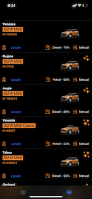

# CarLocatorTest

Requirement: 

Implement an iOS app that retrieves and displays our cars both on a map and on a list.
* The list of cars can be found at https://cdn.sixt.io/codingtask/cars - `DONE`
* In case any car images are missing, use a fall-back image. - `DONE` 
* You may use any external frameworks and libraries you like, just add a short note explaining why
you chose them. - `DONE` 
* Please use Swift with the latest devtools. - `DONE` 
* Show us what you care about when it comes to architecture, structure, clean code, UI/UX, error-
handling and automated testing. - `DONE` 
* Share your code with us either via Github, Bitbucket, zip file. Etc. - `DONE` 

## UI: 
- UI is optimised for iOS 15 iPhone / iPod devices, Landscape mode

## Setup:
- Xcode used 13 Beta 
- Device used to test - iOS 15, iPhone 11

## Architecture: 
- MVVM-C Architure followed. 

## 3rdParty Frameworks:
- MBProgressHUD 3rd party HUD spinner used 

## Applicaiton Info:
- Network Layer is written from scratch
- Cache is sued for storing Car images. Cache can be improoved.
- Orange color used as  primary color 
- Only English language is used 
- Error Handling done, but can be improved

## XCT 
- Code Coverage 60% overall 
- Tried to test entire business logic 

## License

This code is distributed under the terms and conditions of the [MIT license](LICENSE).
