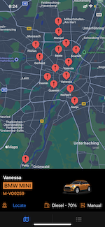

# CarLocatorTest

 

UI: 
- UI is optimised for iOS 15 iPhone / iPod devices, Landscape mode

Setup:
- Application also runs on m1 based Macs (Compatibility mode)
- Xcode used 13 Beta 

Architecture: 
- MVVM-C Arch used

3rdParty Frameworks:
- 3rd party HUD spinner used 

Applicaiton Info:
- Network Layer is written from scratch
- Cache is sued for storing Car images. Cache can be improoved.
- Orange color used as  primary color 
- Only English language is used 
- Error Handling done, but can be improved
